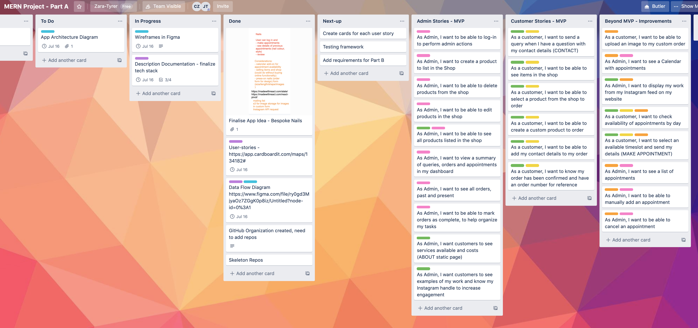

# Bespoke Nails

Developers: **Jade Tyrer & Cassandra Zara**
July, 2020

### Contents
- [Part A](#part-a)
- [Part B](#part-b)

## Part A

Part A of Term 3 Coder Academy MERN application project: _Outline of purpose, planning and tech stack_

## Outline 

#### Purpose
"Bespoke Nails" is known for creating unique and highly detailed hand-painted designs for nails, is based in the UK, and has an established Instagram platform with a strong aesthetic and logo and a loyal customer base. Bespoke Nails (BN) functioned as an in-person appointment beauty service before 2020, and with social distancing rules, has branched out to include pre-made stick-on nails that can be applied by the customer at home.   

The purpose of the application is to extend the online platform and functionality for "Bespoke Nails" to digitally manage customer appointments and orders more easily during the work from home era. The application should allow customer appointments and orders to be made online with a certain level of automation to circumvent all appointments being made via phone call or Instagram direct messages which require a high level of time and effort to keep in order. The application should allow the owner or admin to view and manage the calendar, see all orders in a central location, and send an order confirmation and estimated pick-up time. The application should allow the customer to see availability and request an appointment, order pre-made stick-on nails or create a custom order for stick-on nails. 

Further releases of the application may see the inclusion of customer authentication to see a history of appointments and designs for a more personalised experience and an online store to handle payments. 

#### Target Audience
Bespoke Nails has an established customer base in the physical location of the service, as well as a strong following on Instagram engaging a younger generation through social media. The target audience consists of a younger cohort aged from roughly 14 - 40, with a strong interest in fashion trends, artistic expression and bright, bold design. Bespoke Nails attracts a large percentage of female-identifying persons though gender is not an exclusive characteristic of BN's customers. 

#### Features

##### MVP
The minimum viable product has a scaled-down number of features. The MVP functionality consists of authentication and authorization of an Admin user, CRUD operations for the list of items that can be ordered, as well as a form that the customer can use to create a custom order. The Admin can view the orders in the Admin dashboard and mark as completed which will, in turn, will affect the sorting of the orders. The application will also encompass information about the brand including a menu-style display of appointment cost and options, such as a manicure, $35, 30 mins. For the MVP, the rendering of information including the 'About' and 'Portfolio' aspects will be static with the intention to develop with CRUD operations in a further release that can be utilized by the Admin to update the application themselves. 

In the MVP, the customer does not require authentication as customers have very limited authorization to perform actions. The customer can read and create an order, either by selecting a previously designed item or creating a custom order. The customer can view the 'About' and 'Portfolio' pages and complete a 'Contact' form for queries. 

##### 2nd Release

As visual imagery is a major component in selling the product, a prioritised feature during the 2nd Release is the use of the Instagram developer API, so the admin can utilize the Instagram feed in the portfolio section and streamline sharing of images of their work.

The second release extends customization of the order form, by giving customers the option to upload an image. Image storage is achieved through the use of Amazon S3 cloud storage. 

The second release incorporates calendar and appointment functionality. The visual calendar is accessed via the Admin dashboard once the Admin has been authenticated. The Admin also has the ability to perform CRUD operations on the appointments in the calendar manually, while the appointments made via the application by a customer are automatically added to the calendar. From a customer point of view, a customer can book an appointment by checking a certain day, with available time slots able to book via completion of a form with customer details and appointment options.  

##### 3rd Release

The third release of the application incorporates functionality for the customer to be authenticated and see their history of past appointments and orders. 

The efficiency of Admin-Customer communication is streamlined with the use of emails sent from the application to confirm the order and estimated time of completion for pick-up. 

The third release makes the Update and Delete CRUD actions available for the 'About' page to give the Admin more autonomy in managing the application as it renders (rather than uploading a PDF). 

#### Tech Stack 
The application is created using the MERN stack, which consists of the following technology running in a Node.js environment: 

Storage
- A Mongo Database to manage data about appointments, customers (with appropriate authentication via passport in the server, and client) and orders. 
- AWS Amazon S3 for storage of uploaded images (for custom design) in further release, for increased scalability. 
- Mongoose to interact with MongoDB, as an object modelling tool (Schema design). 

Back-end
- An Express Server which covers the back-end of the application 
- JavaScript libraries: Passport for authentication

Front-end
- React to create the client application which runs in various browsers

Deployment
- Deployment of the server with Heroku
- Deployment of the client with Netlify
- Axios as an HTTP client to manage request and response between the server and client

Project Management Tools
- Git and GitHub for source control
- Figma for diagrams and wireframe prototype
- Trello for Kanban board
- Cardboard for User Stories

## Architecture

The diagram above indicates how different components of the MERN application interact and can be grouped into the Client, Server and Database. The two endpoints communicate through requests and responses with data in the form of JSON, from Axios (an example of a method to handle requests client-side) on the client-side to the API in the back-end. MongoDB will store the text information regarding products, orders and queries and an AWS S3 bucket will store the uploaded images to ensure that it is scalable.

## User Stories
Before Refinement:

After refinement (MVP and prioritised release):

Admin User Stories

Customer User Stories

https://app.cardboardit.com/maps/134182

## Wireframes

[Link to Figma Prototype](https://www.figma.com/file/goZeDczPJzsj4Fe6HBzmLs/Wireframing-(Copy)?node-id=0%3A1)

The design of the application has a consistent colour scheme to communicate the brand on every page. Pink, black and white are the predominant colours used throughout the application as they reference the Bespoke nails logo, and therefore the majority of the application (images will be refined based on accessibility testing at a later date) will adhere to contrast requirements that ensure accessibility. The colour scheme is designed to appeal to the target audience with the design encompassing a simple and modern aesthetic to appeal to a younger demographic and to further aid with the navigation between pages of the application. As the images used to act as a portfolio that is evidence of the highly detailed artwork in each product, it was important that the surrounding content design was clean and simple to invoke the connotation of an art gallery setting and further elevate the product. There is minimal information displayed on each page to ensure the user is drawn to the key purpose and functionality of each page such as completing a form. There are descriptive links with clear navigation to pages with more specific information, for example, the about/prices page which is a key piece of information a consumer may want to know. This aspect of the design is aligned with the user stories and flow within the application. 

 

The navigation bar is consistently displayed at the top and bottom of every page when it is rendered to ensure the user can navigate quickly throughout the entire application and familiarity is quickly gained ensuring a smoother user experience. The landing page has a nail polish in the background to visually communicate the purpose and content of the application. There is a prominent order button designed to stand-out and direct the user to the shop, with the ultimate goal of the user ordering nails. This is strategically placed as the key feature on the homepage and clearly labelled so the user is aware of the action that clicking the button will invoke demonstrating content prioritisation. Colour and imagery are used to enhance space distribution to section the page and allow the user to note different features, for example, purchase of gift cards compared to the lookbook where the user can see examples of the product. 

The secondary purpose of the site is for the administrator to track the products, orders and queries. This is accessed via the admin login at the bottom of the homepage, this link is displayed in the footer as it is not accessible to Bespoke Nail clients but is easily found for admin users that will be aware of where it is located. 

The admin user will be redirected to a dashboard upon successful login, that will display a summary of the queries and orders and will have side navigation that will display this information in more detail when clicked. Further releases will integrate the calendar and appointment functionality seen in the dashboard wireframe. The side navigation will also display a link to the shop which has a similar view to the customer but will also contain the extra links only the authorized admin can see and use to create, update and delete products displayed in the shop. The admin view will display the picture and username of the admin that is logged in with the logout button displayed below for ease of user control. 

There will be a completed message communicated to the user after they have submitted either order or query to ensure the user is aware that their requested action has been committed successfully. This message will include order details and/or details of what steps to expect next to ensure a quality user experience. 

When a user has entered their email to join the mailing list the option be will be greyed out as a visual indication the submission was successful. 

The prototype was designed using Figma demonstrating how the user can navigate through the site. The prototype can be accessed [here](https://www.figma.com/file/goZeDczPJzsj4Fe6HBzmLs/Wireframing-(Copy)?node-id=0%3A1). The link will open and the prototype view can be opened by clicking the play button  in the top right corner. 

  

##### Mobile Views

## Dataflow diagram

Data Flow Diagram for MVP

Diagram Key (Yourdon & Coad conventions)

2nd Release would include Calendar and Appointment features with CRUD operations.

https://www.figma.com/file/ry0gd3MjyaOz7ZGgK0p8iz/Data-Flow---Bespoke-Nails-J%26C?node-id=0%3A1

## Workflow Outline

##### Methodology

The team will be following an agile approach to the project including using a Trello board to show task progress and completion as well as assigning tasks. 

This will follow a 'Kanban' approach of continuous integration over the 4-week timeline with daily stand-ups to reflect on progress and work through problems. Following the Kanban approach, there will be no required roles but rather shared responsibility and transparency where change can occur at any time rather than waiting for the end of a sprint (as in Scrum approaches). A Kanban board (Trello) was set up with the cards being moved between the 'To-do', 'In Progress' and 'Done' with user stories labelled by priority from 'MVP' and 'Beyond MVP', as well as 'Admin' and 'Customer' stories. Stories are also labelled to show complexity such as 'Authentication Not Required' to aid with time estimation. Prioritization of tasks will be determined in morning stand-up, loosely following building a feature with its actions - such as customer order including viewing products in the shop, creating an order with the order form and receiving a confirmation message. Each card should take approximately 3 hours to implement but cards may be broken down further once the project starts after a few days if the expected time frame is found to be inaccurate. Each card will be broken down into fitting out the backend logic, writing and running tests, integration and then front end in React.    

**Git**
A GitHub organization 'Zara-Tyrer' was created for the members of the team to support a shared workspace and repositories. 

3 repositories were created: 
- Part A: Documentation
- React client 
- Express Server 

Individuals then:
- Forked the repositories to individual accounts
- Cloned to local repository 
- Feature Branch is created
- Regular commits pushed to feature branch in forked repository
- Pull request is made to merge feature branch into central (original) repository

## Project Management - Trello Screenshots

Trello was used to map out Part A. Requirements were added as well as important links and ideas. Requirements were allocated and tracked via a coloured tag. 

______________________________________________________________________________________________________

## Part B

### Client

The Bespoke Nails client was built with React, utilizing the built-in React-Dom, React-Router-Dom and React Scripts. It was developed to fulfil project criteria for a MERN stack application for Coder Academy, 2020. 

Deployed on Netlify:
https://bespoke-nails.netlify.app/

### Server

The Bespoke Nails server has 3 main resources with CRUD functionality: Products, Orders and Queries. The server uses Passport Authentication for an Admin user, with no authentication required to access the public routes (see Routes below for specific routes). It has been built with Express using a Node environment and connects to a Mongo Database located on Atlas (Cloud MongoDB). An AWS S3 Bucket has been integrated for image upload for product and order, with the file URL stored as part of the product and order objects (see Schema design).

Using Deployed Server:
https://bespoke-nails.herokuapp.com/

For further information about using the API including routes and format of resource objects, please see: https://github.com/Zara-Tyrer/bespoke-Server

## Part B: Planning and Purpose Update

Current Iteration, as of July 2020:

The purpose of the application is to extend the online platform and functionality for "Bespoke Nails" to digitally manage orders and queries more easily during the work from home era. The application allows orders to be made online for press-on nails either for a pre-made design or by creating a custom order. The application allows the admin user to view and manage all orders and all queries in their dashboard, and manage the products in the shop. The customer is able to see examples of work in the 'Lookbook', view information in the 'About' page, order products from the shop or create a custom order and contact the admin via a query form. The customer receives an order or query confirmation for future reference. The data is persisted in a cloud Mongo database (Atlas), and AWS S3 storage bucket for image upload (see Bespoke-Server in Zara-Tyrer GitHub organization https://github.com/Zara-Tyrer) 

## Client Libraries (Dependencies)

##### React Testing Library
@testing-library/jest-dom
@testing-library/react
@testing-library/user-event

##### Axios
HTTP client to manage request and response between the server API and client application. The two endpoints communicate through requests and responses with data in JSON format. 

##### React-instagram-embed
Structure to embed instagram posts from the product owner page into the 'Lookbook' in the application. 

##### Styled-components
Used for consistent styling and theme across the application and to separate code for clarity in components. 

## Server Middleware

### Middleware

##### AWS SDK
The AWS SDK for JavaScript enables you to directly access AWS services from JavaScript code running in the browser. In the Bespoke Nails server it saves user files to Amazon S3. 

##### Body-parser
"Acts as a JSON parser."[^1] It parses incoming request bodies before using, available in req.body.
[^1]: https://www.npmjs.com/package/body-parser

##### Connect Mongo
MongoDB session store for Connect and Express.[^2] Session is important for cookies and sessionID which stores loggedInUser (user persistence). 
[^2]: https://www.npmjs.com/package/connect-mongo

##### Cors
"The Cross-Origin Resource Sharing standard works by adding new HTTP headers that let servers describe which origins are permitted to read that information from a web browser."[^3]
In the BN server, cors middleware is used to enable CORS with an access list that allows requests from particular domains, and credentials.[^4]
[^3]: https://developer.mozilla.org/en-US/docs/Web/HTTP/CORS
[^4]: https://www.npmjs.com/package/cors

##### Dotenv
"Dotenv is a zero-dependency module that loads environment variables from a .env file into process.env."[^5] In the BN server it is used to load the deployed MongoDB URI and AWS credentials in the development environment. 
[^5]: https://www.npmjs.com/package/dotenv

##### Express Session
"Creates a session where the session data is not saved in the cookie itself, just the session ID."[^6] Session data is stored server-side, with the maxAge set as 180000000ms in the server. In BN server it is used with Connect-mongo as a store solution. 
[^6]: https://www.npmjs.com/package/express-session

##### Mongoose (Schema)
Provides a framework for object modelling (Schema) for Node.js.[^7] Mongoose in-built validation has been used in the BN server. 
[^7]: https://mongoosejs.com/

##### Multer (S3)
"Multer is a node.js middleware for handling multipart/form-data, which is primarily used for uploading files."[^8] In the BN server it has been used to add a file to the request (req.file) object which can then be used in the process of saving the file to the AWS S3 bucket. 
[^8]: https://www.npmjs.com/package/multer

The following 3 pieces of middleware are installed together to effectively use the Passport-Local-Mongoose strategy for authentication. 

##### Passport 
"Passport is authentication middleware for Node.js. Extremely flexible and modular, Passport can be unobtrusively dropped in to any Express-based web application."[^9] In Bespoke Nails, the Passport-local Mongoose strategy is used to provide secure authentication for the Admin user. 
[^9]: http://www.passportjs.org/

##### Passport-local
"Passport strategy for authenticating with a username and password. This module lets you authenticate using a username and password in your Node.js applications. By plugging into Passport, local authentication can be easily and unobtrusively integrated into any application or framework that supports Connect-style middleware, including Express."[^10]
[^10]: http://www.passportjs.org/packages/passport-local/

##### Passport-local-mongoose
"Passport-Local Mongoose is a Mongoose plugin that simplifies building username and password login with Passport. Passport-Local Mongoose does not require passport, passport-local or mongoose dependencies directly but expects you to have these dependencies installed. Passport-Local Mongoose will add a username, hash and salt field to store the username, the hashed password and the salt value."[^11] Once passport/passport-local are configured, passport-local mongoose will implement a local strategy and serializeUser/deserializeUser functions. See config/passport.js in the BN Server and User.js model. 
[^11]: https://www.npmjs.com/package/passport-local-mongoose

### Dev dependencies

##### Nodemon
Nodemon is used in the development environment instead of node to run code so the server will automatically restart when code changes.
https://nodemon.io/

##### Mocha
"A JavaScript test framework running on Node.js for asynchronous testing."[^12] See test folder in BN Server for examples for Mocha tests for the resource utilities functions. 
[^12]: https://mochajs.org/

##### Expect
Package exports the expect function used in Jest[^13]
[^13]: https://www.npmjs.com/package/expect

## Testing (DevDependencies)

**Resource Utilities**

Mocha testing was used in the server with automated recording of tests using a shell script file called 'runtests.sh' in the root directory. **See folder 'test' for test code and 'testResults'** for the records of tests run on CRUD actions of Order, Product and Query resources, located in the root directory of Bespoke-Server.
An example of a test record is included below

**Manual testing of deployed/local database**

Using VS Code HTTP Client to manually test CRUD functionality in local development environment/local DB and deployed server using deployed database

https://docs.google.com/spreadsheets/d/1CYuuwmxb0De-9jqrh4eeWE0-kRsUC8HWzqFssV0k5sE/edit?usp=sharing

**Integration**

Cypress was utilized for end-to-end integration testing. Tests were written and run for the main resources: Product*, Order*, Query and Admin User authentication. Please see the Cypress folder/videos in BN Client to examine the tests. 

*It should be noted that there were difficulties in fully assessing the file upload functionality in the Cypress tests due to integration with AWS S3 storage. The test result demonstrates that a fileLink is created and saved into the resource but there were difficulties rendering the image from the test. This functionality was assessed manually and functions effectively both in the development and production environments. 

## WorkFlow

A forking feature branch workflow was utilized by the developers throughout the project ([Workflow outline from Part A](#workflow-outline)) with daily communication to discuss allocation of tasks. As there was a very high level of verbal communication over video conference about which features were being worked on, consultation and demonstration of new code before merging into the central repository and substantial pair programming, tasks have not always been tagged by developer name. The developers consider the consistent and daily communication in allocating and collaborating on features to have been an effective process throughout the project. 

The user stories were transferred to a Trello Kanban board, and their progress was tracked by tags that further broke down the task by time and difficulty. In general, tasks were first built into the server to develop CRUD functionality, Mocha tests written, Manual testing using VS Code client (client.http) and recorded in a spreadsheet (see docs). The task was then tagged with 'Done in Server'. The task was then moved into from Current Sprint (initial listing of tasks, tagged with Admin or Customer and whether authentication was required to use the route) to the 'To do' column. Once in the To-do column, a developer would then build the functionality into the client and once this was completed and tested manually by completing the action and checking the result in the deployed cloud Mongo database, the task was tagged 'Done in Client'. The task would then be moved into the 'In progress - needs styling' column. The developer would then apply styling and once satisfied, the task would be moved into the 'Done & Styled' Column. Cypress testing was used to assess the effectiveness of integration between the client, server, cloud database and the S3 bucket that was incorporated for file upload (see tasks tagged 'Beyond MVP'). The developers would regularly undertake review to consult and collaborate on choices about further functionality and styling on tasks in the 'Done & Styled' column. 

Trello board: https://trello.com/b/iQyZYJnh/mern-project-part-a

<!--  -->

<!--  -->

